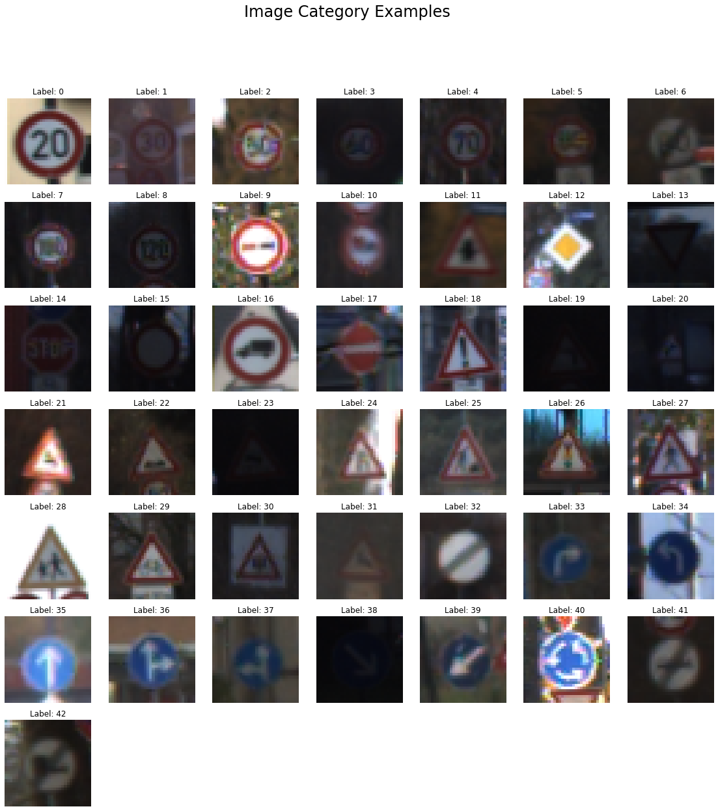
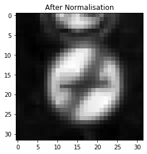
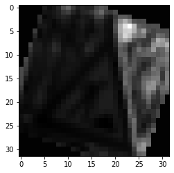
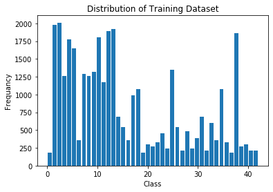
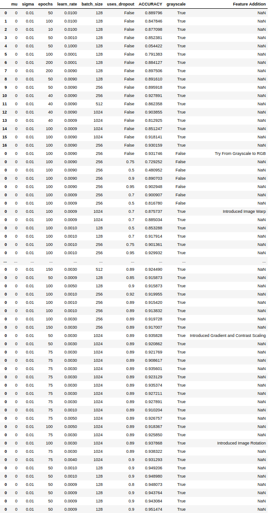
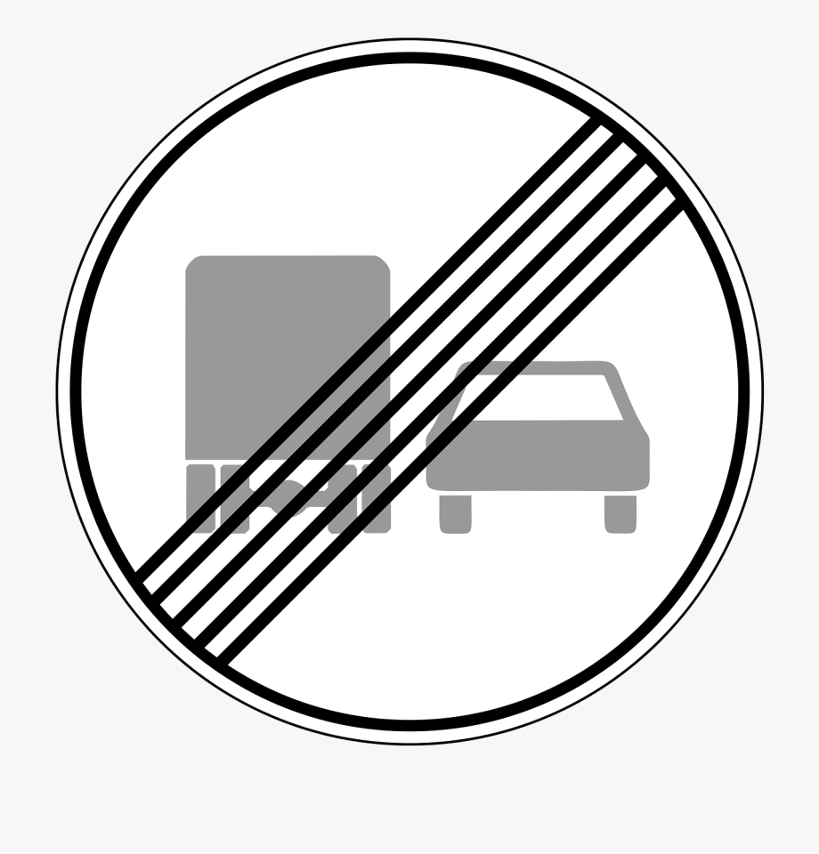
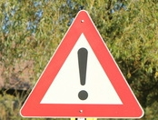
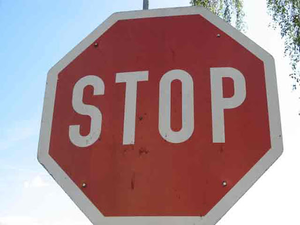

# **Traffic Sign Recognition CNN - Charlie Rance** 

---

**Build a Traffic Sign Recognition Project**

The goals / steps of this project are the following:
* Load the data set (see below for links to the project data set)
* Explore, summarise and visualise the data set
* Design, train and test a model architecture
* Use the model to make predictions on new images
* Analyse the softmax probabilities of the new images
* Summarise the results with a written report

---
## Theory of Operation

### Data Set Summary & Exploration

The dataset that was used is taken from the German traffic sign dataset [here](http://benchmark.ini.rub.de/?section=gtsrb&subsection=dataset). The idea is that through training with this dataset we should be able to detect and classify roadsigns for use within an autonomous vehicle stack.

Initially, I needed to understand the shape and distribution of the dataset. To do this, I performed some hard coded numerical calculations with numpy that showed us the following:

<pre><code>
Number of training examples = 34799
Number of validation examples =  4410
Number of testing examples = 12630
Image data shape = (32, 32, 3)
Number of classes = 43
</code></pre>

From this, we can now see that our dataset is comprised of 32x32 images that have been split into training, validation and test batches. We can also see here that we have 43 classes of roadsigns that have been annotated from their origional image and labeled. The full labeling catagorisation can be found [here](./signnames.csv). A visualisation of all the unique images can be seen here below:

### Augmentation of The Dataset

To improve the training and variability in the dataset, I introduced various steps of augmentation to increase the variability in our dataset:

1) I converted our images to grayscale; the reasoning behind this is we can see in the paper [here](http://yann.lecun.com/exdb/publis/pdf/sermanet-ijcnn-11.pdf) Yann LeCun et al. attempted to tackle a similar problem and managed to achieve much better results using grayscale compared to colour shown in the following quote:
`The ConvNet was trained with full supervision on the color
images of the GTSRB dataset and reached 98.97% accuracy
on the phase 1 test set. After the end of phase 1, additional
experiments with grayscale images established a new record
accuracy of 99.17%.`

2) I then normalised our images by converting our grayscale intensity values to a Z-score. I experimented with multiple methods of normalisation including min/max and converting the bexel intensities using a predefined value (128). However, what I found was that by converting to a Z score we got much closer to a mean of 0 and a variance of 1:
<pre><code>
Mean of Training Set After Normalisation: 8.212440852174224e-16
Variance of Training Set After Normalisation: 1.0000000000000007
</code></pre>
What this means is that when we initialise our weights for our CNN we will get a much better initial starting result by taking a value from a gaussian with a mean of 0 and an std_dev of 0.1.
An example of the result we get from this normalisation process is:

3) I then wanted to increase the dataset to include images in different lights and perspectives. To do this I used the following logic:
    
a) Take a copy of the image set and randomly warp the image from src to a random int for the edges of the image.

b) For each even index image we brightened the pixels by adding 1 to the pixel value and dividing by 1 + the max pixel value of the image. We then randomly rotate the image somewhere between -20 and +20 degrees.

c) For every odd index I changed the contrast of the image, I did this using numpy to detect in each pixel where it was less than the mean. If this was the case, I subtracted the mean otherwise, I increase the brightness using the same technique I used in part b above. Finally, I again rotated the image randomly between -20 and +20 degrees.

The output of the augmented image looks something like this:

Now we have an augmented dataset we can concatenate this with the original training set. This provides a diversity in the training set that we didn't already have that allows us to detect signs better in different lights along with different orientations and translations. Due to this, we have now doubled the size of the dataset along with changing the distribution:

`Number of training samples after augmentation: 69598`

Distribuiton:

### Model Architecture

My model consists of a traditional LeNet5 CNN structure with the layers adapted to fit with my image size along with the label count. I have also included in this structure a layer of [dropout](http://jmlr.org/papers/volume15/srivastava14a/srivastava14a.pdf), this is to help minimise the potential of overfitting to our training set. The dropout includes a configurable hyperparameter of `keep_prob` which is the likelihood that the network will keep our logits instead of discarding.

My final model consisted of the following layers:

| Layer         		|     Description	        					| 
|:---------------------:|:---------------------------------------------:| 
| Input         		| 32x32x1 Grayscale image   					| 
| Convolution 5x5     	| 1x1 stride, valid padding, outputs 28x28x6 	|
| RELU					|												|
| Max pooling	      	| 2x2 stride,  outputs 14x14x6  				|
| Convolution 5x5	    | 1x1 stride, valid padding, outputs 10x10x16 	|
| RELU					|												|
| Max pooling	      	| 2x2 stride,  outputs 5x5x16   				|
| Flatten				| outputs 400									|
| Fully connected		| outputs 120  									|
| RELU					|												|
| Dropout				|						 						|
| Fully connected		| outputs 84  									|
| RELU					|												|
| Fully connected		| outputs 43  									|
| Return Logits			|												|

---
### Training, Experimentation and Hyperparameters

#### Optimiser Techniques

For my optimisation, I  went for a version of Stochastic gradient descent called the Adam optimiser. Here we take in our cost function which is the average of the cross entropy over the entire dataset and perform minimalistic steps to reduce the value of the cost function. The difference between using the Adam Optimiser here vs the traditional stochastic gradient descent, is that Adam allows us to use a slightly more flexible learning rate based upon the square of the gradient as well as the value of our cost function.

#### Hyperparameters

The final values of my hyperparameters were as follows:

| Parameter        | Value  |
|------------------|--------|
| Learning Rate    | 0.0009 |
| Keep Probability | 0.9    |
| Mu               | 0      |
| Sigma            | 0.1    |
| Epochs           | 50     |
| Batch Size       | 128    |

This Achieved:

| Test           | Accuracy |
|----------------|----------|
| Validation     | 95.1%    |
| Test           | 93.4%    |
| New Images (5) | 100%     |

#### Experimentation

I tried multiple steps to improve my training and validation accuracy:

1) Initially, I experimented using just the original, dataset converted to grayscale and normalised but with unagumented images to increase the dataset. Here I found that by tuning my parameters I could achieve a validation accuracy of ~93%; however, it required a higher learning rate and higher ammount of epochs which made the results unstable.

2) I then experimented with changing my images to RGB and normalising. To do this I also adapted my model to take in input with a depth of 3 instead of 1; however, with these RGB images I found that no matter how much I tuned my hyperparameters the most I could achieve was 90% validation so I decided to switch back to using grayscale images.

3) At this point, I also noted that my training accuracy was very high but my validation accuracy was not so good. This is highly symptomatic of overfitting. To combat this, I introduced a dropout layer. I played around with the position of this layer in the model, the `keep_prob` and the amount of dropout layers until I found a nice area where the training and validation seemed to rise together.

4) I next switched back to grayscale and tried adding to my dataset with just warped images. I adjusted hyperparameters as well as the amount of warp applied but acutally found these results to be only a very slight improvement achieving a maximum of 93.5% validation accuracy.

5) My next step was to play with the gradients of the images as well as the warping. What I found here was that initially my validation accuracy was slightly lover at ~92%; however, my results were now much more consistent at this level, indicating that my training was now becoming much more stable.

6) My final step, was to include rotation into the augmented set. I adjusted the amount of the random rotation and found that with tuning of the hyperparameters I was able to consistently achieve >95% validation accuracy and >93% test accuracy.

Full details of my logged reuslts can be seen below:

---
### Test a Model on New Images

#### Image Selection

Now that I was happy that my network was achieving good results, I decided to test the performance on 5 new images from the internet.

I chose these images so that they all had different characteristics to stress test different areas of my model:

- I chose this first image as it is a complex shape with multiple different gradients and shapes that could be highly confusing to model.

-I chose this second image as we can see that the image is fairly bright therefore provides a different gradient for the network to have to contend with.

-This 3rd image has quite a complex background with different colours and textures however the sign itself is nicely defined.

- The 4th image is interesting as it is blue on blue with some white however it could be quite difficult to distinguish.

- The final image could be challenging as it is quite gritty and grainy and also provides a different perspective to try and analyse.

#### Image Results

The results of running the NN against these images shows that we get 100% accuracy!

What is also good to see here, is that our softmax probabilities for the 5 images show a very decisive choice on what class each image falls under:

<pre><code>
INFO:tensorflow:Restoring parameters from ./traffic_sign
Probabilities: [1.0000000e+00 1.0175506e-31 7.2917263e-37 0.0000000e+00 0.0000000e+00]
Classes:       [18 27 26  0  1]

**********

Probabilities: [9.9830365e-01 1.6963693e-03 2.1400662e-16 3.7091583e-17 5.2023130e-18]
Classes:       [41 42  6 32 16]

**********

Probabilities: [1.0000000e+00 6.7619466e-10 3.8541273e-10 3.8300543e-10 2.1198143e-13]
Classes:       [14 13 15  3 33]

**********

Probabilities: [1.0000000e+00 5.1753852e-14 2.3826574e-17 1.9859522e-33 1.3351188e-38]
Classes:       [33 35  3  7  5]

**********

Probabilities: [1.0000000e+00 7.6311357e-10 1.5111172e-23 0.0000000e+00 0.0000000e+00]
Classes:       [4 0 1 2 3]

**********
</code></pre>